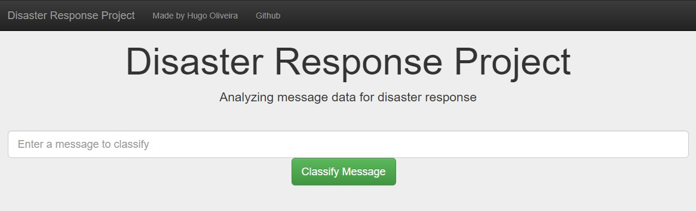
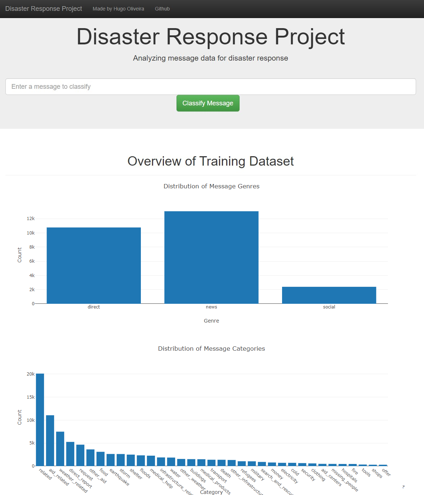
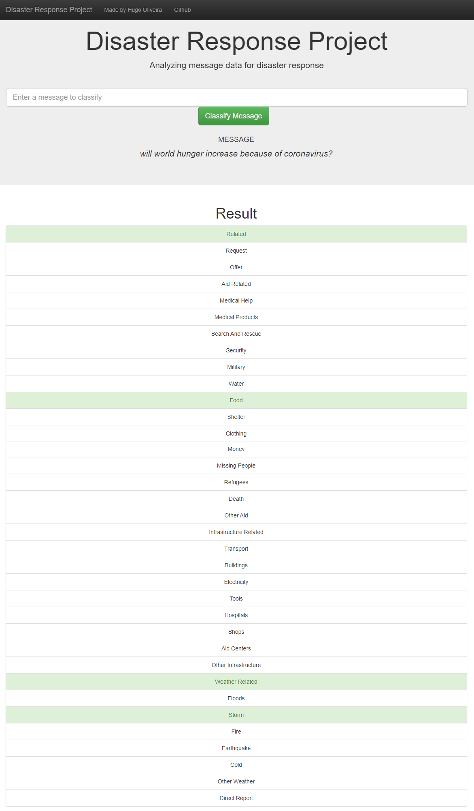
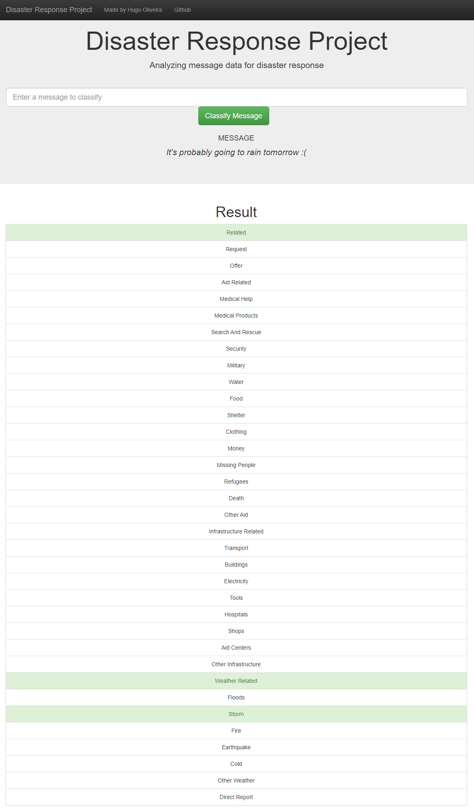

# Disaster Response Pipeline



## Table of Contents
1. [Description](#description)
2. [Dependencies](#dependencies)
3. [Installing](#installation)
4. [Executing Program](#execution)
5. [Exploration Files](#exfiles)
6. [Web App Pipeline Files](#appfiles)
7. [Screenshots](#screenshots)

<a name="descripton"></a>
## Description

In this project, we analyze disaster data from Figure Eight(a dataset that contains real messages and tweets that were sent during disaster events). We will also build a model for an API that categorizes these event messages so that they can sent to an appropriate disaster relief agency.

We also developed a include a web app where an emergency worker can input a new message and get classification results in several categories and display visualizations of the data.

This project is divided in the following key sections:

1. An ETL pipeline that loads the messages and categories datasets, merges the two datasets, cleans the dataand stores it in a SQLite database;
2. A machine learning pipeline that uses NLTK, as well as scikit-learn's Pipeline and GridSearchCV to output a final model that predicts the classes for 36 different categories (multi-output classification);
3. A web app that shows the classification results and visuzlizations for any user given input, in real time.

<a name="dependencies"></a>
## Dependencies
* Python 3.5+
* Machine Learning Libraries: NumPy, Pandas, Sciki-Learn
* Natural Language Process Libraries: NLTK
* SQLlite Database Libraqries: SQLalchemy
* Model Loading and Saving Library: Pickle
* Web App and Data Visualization: Flask, Plotly

<a name="installation"></a>
## Installing
To clone the git repository:
```
git clone https://github.com/HROlive/disaster-response-pipeline.git
```
<a name="execution"></a>
## Executing Program
1. You can run the following commands in the project's directory to set up the database, train model and save the model.

    - To run ETL pipeline to clean data and store the processed data in the database
        `python data/process_data.py data/disaster_messages.csv data/disaster_categories.csv data/disaster_response_db.db`
    - To run the ML pipeline that loads data from DB, trains classifier and saves the classifier as a pickle file
        `python models/train_classifier.py data/disaster_response_db.db models/classifier.pkl`

2. Run the following command in the app's directory to run your web app.
    `python run.py`

3. Go to http://0.0.0.0:3001/

<a name="exfiles"></a>
## Exploration Files

In the **data** and **models** folder you can find two jupyter notebook that will help you understand how the model works step by step:
1. **ETL Preparation Notebook**: learn everything about the implemented ETL pipeline
2. **ML Pipeline Preparation Notebook**: look at the Machine Learning Pipeline developed with NLTK and Scikit-Learn

You can use **ML Pipeline Preparation Notebook** to re-train the model or tune it through a dedicated Grid Search section.

<a name="appfiles"></a>
## Web App Pipeline Files
**app/templates/***: templates/html files for web app

**data/process_data.py**: Extract Train Load (ETL) pipeline used for data cleaning, feature extraction, and storing data in a SQLite database

**models/train_classifier.py**: A machine learning pipeline that loads data, trains a model, and saves the trained model as a .pkl file for later use

**app/run.py**: This file can be used to launch the Flask web app used to classify disaster messages

<a name="screenshots"></a>
## Screenshots

1. The homepage shows some graphs about training dataset, provided by Figure Eight



2. After we input the desired message and click **Classify Message**, we can see the categories which the message belongs to highlighted in green




